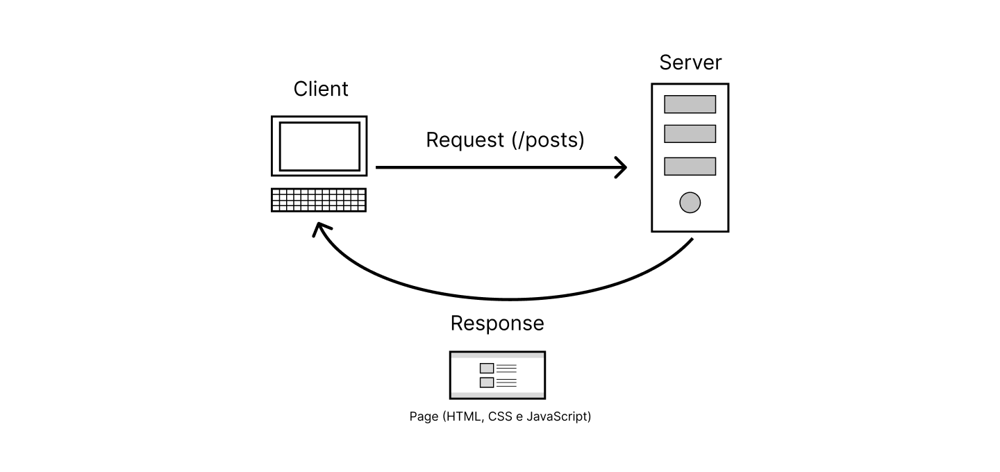
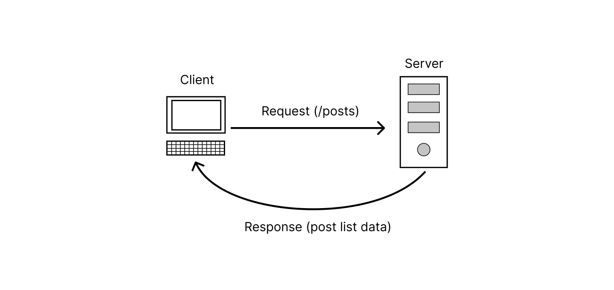

<h1  align="center">Fundamentos React</h1>

<div align="center">


</div>

## 📖 Sobre o respositório

<p>
    o propósito desse repositório é compartilhar minha jornada de aprendizado com a biblioteca React do JavaScript.
</p>

## React

<p>Recentemente comecei a estudar sobre o React, uma ferramenta bastante interessante e com um ecossitema enorme por volta dela. Com esse intuito venho compartilhar um pouco sobre o que aprendi inicialmente sobre a biblioteca react.</p>

### O que é React?

<p>O React é uma biblioteca JavaScript usada para criação de interfaces interativas de usuário. Sendo uma das principais ferramentas utilizadas hoje em dia, podemos usá-la também em dispositivos mobile, tv e até em realidade virtual. O React utiliza uma sintaxe chamada JSX (JavaScript + XML), que é semelhante a sintaxe do HTML, para criar componentes na interface.</p>

<p>O React faz uso de outras ferramentas, como:</p>

- [Babel](https://babeljs.io/)
- [Webpack](https://webpack.js.org/)

<p>No entanto vale ressaltar que existe frameworks que utilizam a biblioteca React, como:</p>

- [Next.js](https://nextjs.org/)
- [Remix](https://remix.run/)

### SPA & SSR

<p>SPA e SSR são formas de rendizar o conteúdo, ou seja, mostrar o conteúdo em tela (interface), também conhecido como Rendering Patterns.</p>

**SSR (Server-side Rendering)**

<p>O SSR (Server-side Rendering) é um dos métodos de renderização de conteúdo na web. Nesse método, o que acontece é que gera HTML completo para o conteúdo da página ser renderizado como resposta para o usuário que fez a requisição.</p>

<p>Em outras palavras, quando o usuário requisita um paǵina da nossa aplicação, por exemplo, o servidor busca por essa página no banco de dados (que é onde está todo o código backend e frontend), depois ele retorna todo esse conteúdo da página pronto para o navegador rendizar em tela.</p>

**Exemplo:**



**SPA (Single Page Application)**

<p>O SPA (Single Page Application) é um outro método de renderização de conteúdo na web. Nesse método, o que acontece é que quando o usuário faz uma requisição para acessar a rota posts (que seria uma listagem de posts), o backend vai buscar no banco de dados a listagem dos posts, não tendo mais que armazenado todo código backend e frontend da aplicação, apenas os dados necessários para mostrar em tela.</p>

<p>É importante ressaltar que os dados eles são retornados em um formato JSON. Dessa forma, o mesmo JSOn ele pode ser usado para renderizar uma página pelo ReactJS e para múltiplas plataformas, como: IOS/Android pelo React Native, por exemplo.</p>

**Exemplo:**


### Bundlers & Compilers

**Compilers:**

<p>Um compiler muito famoso no universo JavaScript é o Babel.</p>
<p>O Babel é um compilador usado para pegar sintaxes mais atuais do JavaScript e converter para um código compatível para os browsers (navegadores).</p>

**Bundlers:**

<p>Um bundler muito utilizado no universo JavaScript é o Webpack.</p>
<p>Webpack é um bundler usado para pegar arquivos gerados pelo React e converter para um único arquivo ara que o browser (navegador) possa entender e executar.</p>

<p>Apesar de alguns browsers terem suporte a importação de modules JS, o Webpack ainda se faz bastante necessário m alguns casos.</p>

## 📌 Tecnologias Utilizadas

<p>As seguintes ferramentas foram usadas na construção do projeto:</p>

- React, versão: 18.2.0
- Vite, versão: 3.2.3

## ⌨ Como usar?

1. Nesta primeira parte você irá clonar o repositório:

   ```bash
   git@github.com:leticiadia/react-studies.git

   ```

2. Em seguida, você entrará no diretório:
   ```bash
   cd react-studies
   ```
3. O próximo passo é instalar as dependências:

   ```bash
   npm install
   ```

4. Execute a aplicação para o modo de desenvolvimento
   ```bash
   npm run dev
   ```

## 🧑‍🚀🚀 Contribuição

<p>Solicitações de pull são bem-vindas. Para grandes mudanças, abra uma issue primeiro para discutir o que você gostaria de mudar.</p>

## 👩‍💻 Autora

<p>Desenvolvido 💜 por Leticia Dias!</p>
